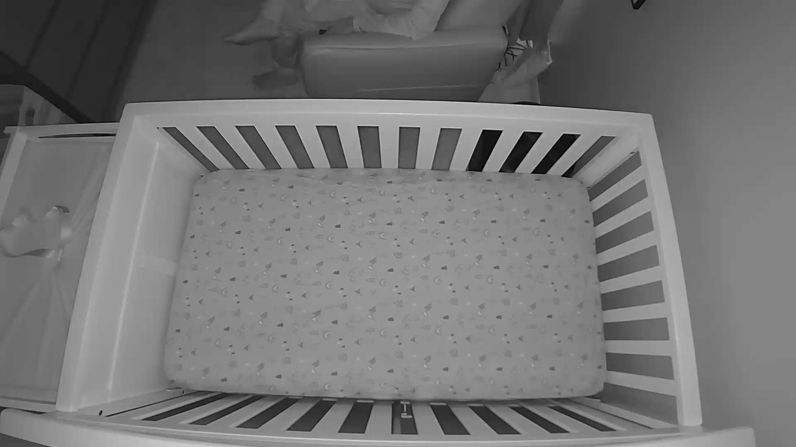
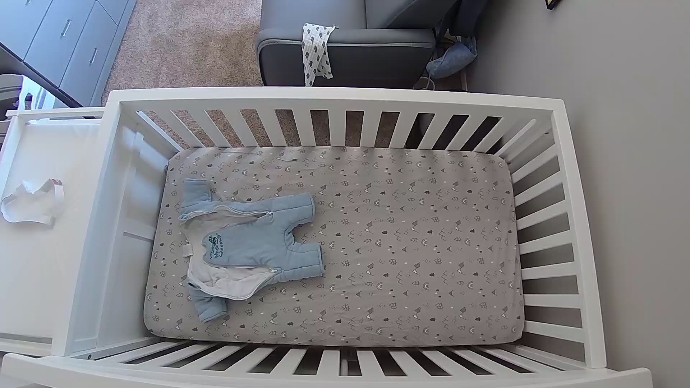
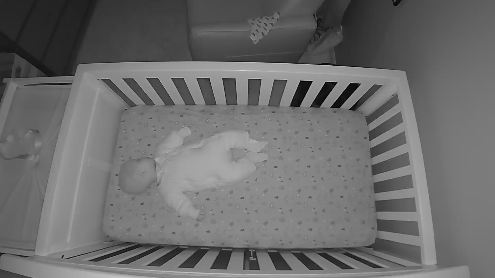

# Real-time Image classification using an RTSP stream

I developed this Pytorch project to solve a simple use case: notifying Home Assistant (HA) if my son is in or out of his crib. From there I have HA switch off the night light and change the audio from lullaby to white noise for the duration of his nap. I tried to keep it as simple as possible so I could get an understanding of how to use image classification.

Originally I wrote this in Tensorflow, but was struggling with deprecated features and undocumented changes. To my surprise, the real_time_video_proc processor went from 30% of my i3 CPU to an average of 7% which was an unintended benefit. 

I capture the RTSP stream of a Nanit camera (great hardware, but no publicly accessible API) using Scrypted to authenticate and expose the stream on my local network. I then have BlueIris take a snapshot every 5 minutes to build a library of training data. I then manually sorted the images into true or false folders. The Scrypted RTSP stream is then consumed by OpenCV as you will see in the video processing library.

When the model determines my son is present or not present in the crib, it will toggle an input_boolean helper object using the Home Assistant REST API, this is demonstrated in toggle_josh_crib.py. The toggle is asynchronous and periodically checks the toggle value so its gentle on the API endpoint.

## Model Training
I used approximately 30,000 images from sleep patterns over a 1 month time period. The FileManager class function split_data_for_validation() will randomly select 20% of the images in each class and place them into a validation folder to validate the model as it trains to prevent over-fitting. 

Images were converted to greyscale during training to prevent the model from focusing on light changes with the cameras night vision. Histogram is used in the OpenCV monitor to balance the light level across transitions.

I train the model on my main windows box and run the service on my ubuntu appliance. The train_model.py and supporting FileManager class supports both Windows and Linux file paths. On average, each Epoch takes about 400 seconds to train with sometimes 17 Epochs using an Nvidia RTX 4070 GPU.

## Running as a service on Linux
```bash
cat /etc/systemd/system/baby_crib_video_proc.service

[Unit]
Description=Real Time Video Processing Service
After=network.target

[Service]
Type=simple
WorkingDirectory=/home/user/josh_crib_check/
ExecStart=/usr/bin/python3.10 /home/user/josh_crib_check/real_time_vid_proc.py
Restart=always
User=user
Group=user

[Install]
WantedBy=multi-user.target

```
## Creds.py file
```bash
nas_host = "host_name_or_ip"
nas_user = "user"
nas_password = "password" #only using rsync on linux
nas_path = "/share/training_data/josh_crib" #classified images are stored under here, for windows user the share/folder_name
model_name = 'baby_crib'
rtsp_url = "rtsp://1.2.3.4:567/a354jad"
home_assistant_url = "http://1.2.3.4:8123/api/"
ha_access_token = "ha long lived token"
ha_entity_id = "input_boolean.baby_in_crib"
```

## File System
During training, this is set to pull from a NAS, which isn't entirely necessary, its just how I have it setup in my home (BlueIris dumps snapshots to my NAS, then I rsync or robocopy to my trianing machine). You can run the training script with --skip_sync_source if your training data is already in the project folder. You will also need to manually seperate out your validation data.
The file structure should look like this:
```
<root of project>/
  <model_name in creds>/
  └── training_data/
      ├── true/
      └── false/
```

## Image Samples
<p align="left">
  
  
  
</p>